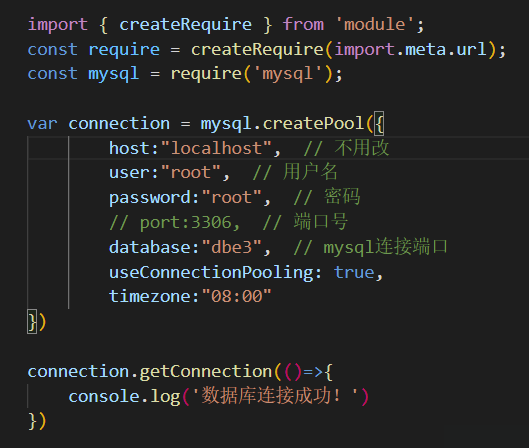

# 说明

* 图书馆管理系统所有前后端都包含在内，所有依赖也已安装
* 各端口：
  * 数据库端口：3306
  * 后端端口：8080
  * 前端端口：未定，运行时集成终端会显示

# 使用

1. 安装nodeJs
2. 建立名为 ``dbe3``的数据库，在该数据库下，运行两个数据库脚本（mysql语言）
3. 在 ``./backEnd/connection.js``里按自己数据库进行修改
   
4. 在 ``./backEnd/``里用命令行执行 ``node app.js``
5. 在前端命令行执行 ``npx vite --host 0.0.0.0``
6. 每个人的初始账号已包含在sql脚本中，登录账号为学号，密码为自己名字的首字母（登陆记得选择**管理员登录**），额外添加 ``测试用户``，登录账号为 ``20370001``，密码为 ``test``。
